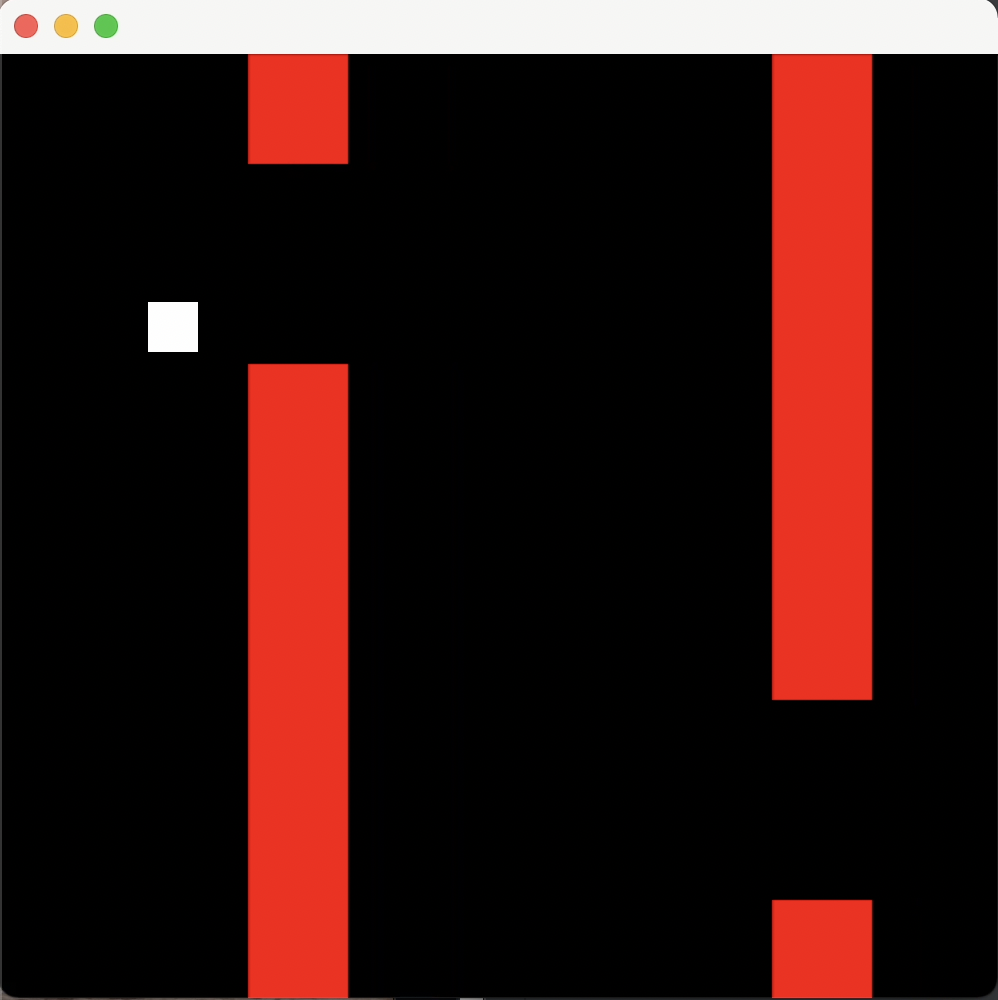

# Flappy_Bird

## Project Description
This project's goal was to recreate the flappy bird game with Java GUI.

## Languages
Java

## How to Run
Open in your IDE. Run FlappyFrame.java file.

## How to Use
This would be used as a game in itself or as a smaller game in a larger application.

## Future Plans
There are multiple parts I'd like to build on in the future. Adding a score board which keeps track of the points is one. Also, changing the white square to another, funner symbol. Also, start, stop, and quit buttons.